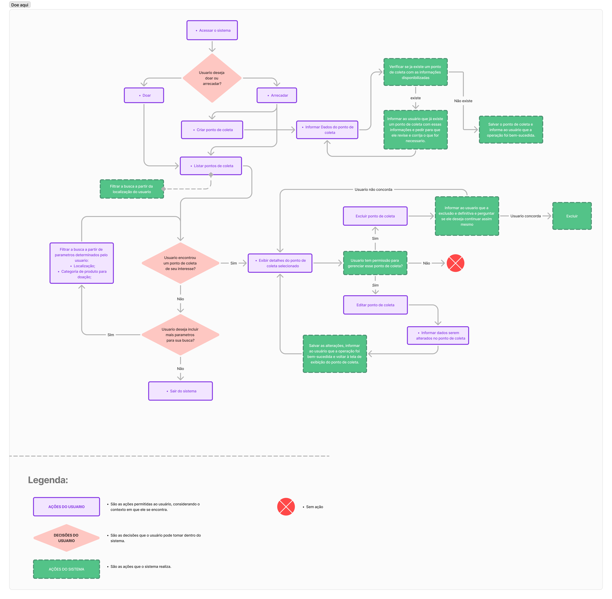
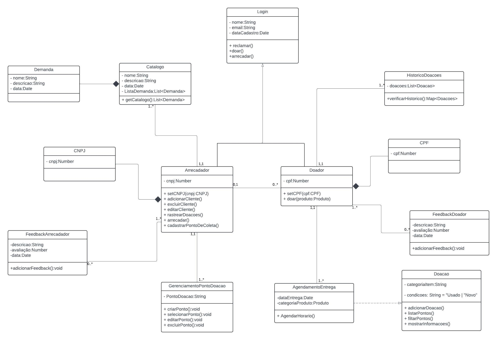

# 3. DOCUMENTO DE ESPECIFICAÇÃO DE REQUISITOS DE SOFTWARE

## 3.1 Objetivos deste documento
Descrever e especificar as necessidades e funções do projeto Doe Aqui.

## 3.2 Escopo do produto

### 3.2.1 Nome do produto e seus componentes principais
O produto será denominado Doe Aqui. (Ele terá dois componentes (módulo) com os  elementos necessários à doar e arrecadar.)

### 3.2.2 Missão do produto
Facilitar a Doação e Encontrar Instituições: O principal objetivo do projeto é auxiliar as pessoas a aprenderem como doar de forma mais eficiente e a encontrar instituições locais que estejam realizando campanhas de caridade. Isso permitirá que mais indivíduos contribuam para causas nobres de maneira fácil e direta.

### 3.2.3 Limites do produto
O Doe Aqui não fornece nenhuma forma de entrega ou recolhimento de doações.

### 3.2.4 Benefícios do produto

| # | Benefício | Valor para o Cliente |
|--------------------|------------------------------------|----------------------------------------|
|1	| Facilidade no cadastro de dados |	Essencial |
|2 | Facilidade na recuperação de informações | Essencial | 
|3 | Segurança com os dados coletados| Essencial | 
|4	| Praticidade no uso do software	| Recomendável | 
|5	| Software com o custo baixo | Recomendável | 

## 3.3 Descrição geral do produto

### 3.3.1 Requisitos Funcionais

| Código | Requisito Funcional (Funcionalidade) | Descrição |
|--------------------|------------------------------------|----------------------------------------|
| RF1 | Gerenciar Agendamento de Coleta (ou entrega da doação) |	O sistema deve permitir o cadastro, alteração e exclusão de agendamentos. |
| RF2	| Gerenciamento doação |	O sistema deve permitir o cadastro, a alteração, a exclusão e a consulta de doações. |
| RF3	| Gerenciar Doador |	O sistema deve permitir o cadastro, a alteração, a exclusão e a consulta de doadores. |
| RF4	| Gerenciar Instituição |	O sistema deve permitir o cadastro, a alteração, a exclusão e a consulta de instituições. |
| RF5	| Gerenciar Pontos de Coleta |	O sistema deve permitir o cadastro, a alteração, a exclusão e a consulta de pontos de coleta. |
| RF6	| Gerenciar demandas |	O Sistema deve permitir que o usuário pesquise um item, ex.: Roupas, cestas básicas, materiais de construção e etc. |
| RF7	| Gerenciar Feedbacks |	O Sistema deve permitir que o usuário cadastre, altere e exclua apenas o seu feedback. |
| RF8	| Gerenciar notícias |	O Sistema deve permitir que o usuário cadastre, altere e exclua notícias sobre sua doação ou do doador. |
| RF9	| Gerenciar Categorias de Doação |	O sistema deve permitir o cadastro, a alteração, a exclusão e a consulta de categorias de doações. |
| RF10 |	Históricos de doações	| O sistema deve permitir que o usuário veja e pesquise seu histórico de doações. |
| RF11 |	Realizar recomendações	| O sistema deve permitir que o usuário receba recomendações. |
| RF12	| Login |	O sistema deve realizar o login de pessoas e das instituições. |
| RF13	| logout |	O sistema deve realizar o logout de pessoas e das instituições. |
| RF14	| Feedbacks (avaliações de ambas as partes) |	O sistema deve permitir o feedback. |
| RF15 | Gerenciar conteúdos informacionais do site |	O sistema deve permitir o cadastro, a alteração, a exclusão, e a pesquisa de conteudos no site. |

### 3.3.2 Requisitos Não Funcionais

| Código | Requisito Não Funcional (Restrição) |
|--------------------|------------------------------------|
| RNF1 | O sistema deve garantir a segurança dos dados de acordo com a LGPD. |
| RNF2 | O sistema deve possibilitar qualquer realização de tarefas em no máximo 4 cliques. |
| RNF3 |	O sistema deve processar requisições dos usuários de no máximo 3 segundos. |
| RNF4 |	O sistema deve ser desenvolvido na tecnologia JavaScript/React. |

### 3.3.3 Usuários 

| Ator | Descrição |
|--------------------|------------------------------------|
| Arrecadador |	Usuário responsável por anunciar, organizar e receber doações. |
| Doador |	Usuário que vai procurar pontos de coleta para realizar sua doação. |

## 3.4 Modelagem do Sistema

### 3.4.1 Diagrama de Casos de Uso

Como observado no diagrama de casos de uso da Figura 1, o usuario poderá exercer dois papeis no sistema, o de doador e o de arrecadador, o primeiro com a possibilidade  de listar pontos de coleta, e o segundo com o poder de gerenciar os pontos de coleta, criando, atualizando e excluindo.

#### Figura 1: Diagrama de Casos de Uso do Sistema.

 
### 3.4.2 Descrições de Casos de Uso

#### Listar Ponto de Coleta (CSU01)

Sumário: O usuário consulta os pontos de coleta de acordo com os critérios de seu interesse.

Ator Primário: Doador / Arrecadador.

Pré-condições: N/A.

Fluxo Principal:

1)  O usuário acessa o sistema para buscar pontos de coleta.
2) 	O sistema apresenta uma lista de pontos de coleta com base na localização do usuário.
3) 	O usuário seleciona um ponto de coleta para visualizar seus detalhes.

Fluxo Alternativo (3): Inclusão

a) O Arrecadador solicita a inclusão de um ponto de coleta.  
b) O sistema apresenta uma janela solicitando informações do ponto de coleta.  
c) O Arrecadador fornece os dados solicitados.  
d) O sistema verifica se o ponto de coleta já está cadastrado. Se sim, o sistema informa o Arrecadador e retorna ao início; caso contrário, apresenta um formulário em branco para que os detalhes do ponto de coleta sejam preenchidos.  
e) O sistema verifica a validade dos dados. Se os dados forem válidos, inclui o novo ponto de coleta; caso contrário, informa o erro, solicita novos dados e repete a verificação.  

Fluxo Alternativo (3): Remoção

a) O Arrecadador seleciona um ponto de coleta e solicita sua remoção.  
b) Se o ponto de coleta puder ser removido, o sistema realiza a remoção; caso contrário, informa o Arrecadador.  

Fluxo Alternativo (3): Alteração

a) O Arrecadador altera um ou mais detalhes do ponto de coleta e solicita sua atualização.  
b) O sistema verifica a validade dos dados e, se forem válidos, atualiza as informações; caso contrário, informa o erro.  
 
Fluxo Alternativo (3): Detalhes

a) O Arrecadador opta por visualizar os detalhes de um ponto de coleta.  
b) O sistema apresenta uma lista de pontos de coleta.  
c) O Arrecadador seleciona o ponto de coleta desejado.  
d) O sistema apresenta os detalhes do ponto de coleta em um formulário.  

Pós-condições: Um ponto de coleta foi inserido, removido, seus dados foram alterados ou apresentados na tela.

### 3.4.3 Diagrama de Classes 

A Figura 2 mostra o diagrama de classes do sistema. A Matrícula deve conter a identificação do funcionário responsável pelo registro, bem com os dados do aluno e turmas. Para uma disciplina podemos ter diversas turmas, mas apenas um professor responsável por ela.

#### Figura 2: Diagrama de Classes do Sistema.
 

### 3.4.4 Descrições das Classes 

| # | Nome | Descrição |
|--------------------|------------------------------------|----------------------------------------|
| 01	|	Login |	Representa as informações de login de um usuário. Inclui nome, e-mail e a data de cadastro. Permite as ações de "reclamar", "doar" e "arrecadar". |
| 02	| Demanda |	Descreve uma demanda com nome, descrição e data. Está associada ao catálogo de demandas. |
| 03 |	Catalogo |	Contém uma lista de demandas. Possui atributos como nome, descrição, data, e métodos para retornar o catálogo. |
| 04 |	Doação |	Cadastro de informações e metodos relativos as Doações. |
| 05	|	CNPJ | Armazena o número de CNPJ de um cliente arrecadador. |
| 06	|	CPF |	Armazena o número de CPF de um doador. |
| 07	|	Arrecadador |	Representa um arrecadador (cliente com CNPJ). Possui métodos para adicionar, excluir, editar clientes e gerenciar doações. |
| 08	|	Doador |	Representa um doador (cliente com CPF). Possui métodos para realizar doações e associar CPF. |
| 09	|	GerenciamentoPontoDoacao |	Gerencia os pontos de doação. Inclui métodos para criar, selecionar, editar e excluir pontos de doação. |
| 10	|	AgendamentoEntrega |	Trata do agendamento de entregas, incluindo a data da entrega e a categoria de produtos. |
| 11	|	Doacao| Armazena informações sobre doações, incluindo a categoria de produtos e a condição do item (novo ou usado). Permite adicionar, listar e filtrar pontos de doação. |
| 12	|HistoricoDoacoes |	Armazena o histórico de doações. Possui um método para verificar o histórico de doações. |
| 13	|	FeedbackArrecadador |Armazena o feedback sobre o arrecadador, incluindo a descrição, avaliação e data do feedback. |
| 14	|	FeedbackDoador |		Armazena o feedback sobre o doador, incluindo a descrição, avaliação e data do feedback. |
